# Forms Workflow Diagram

## Part 4: Forms + Backend + Database Relation

### Speech

"Our Django Forms are tightly integrated with our PostgreSQL database through Django's ORM. Here is how data flows:

1. User fills HTML form in the browser - rendered by Django templates from our forms.py files
2. Form submits via POST to a Django view endpoint
3. View processes the data - either using form.is_valid() or manual request.POST extraction
4. Django ORM creates or updates records - Model.objects.create() or model.save()
5. PostgreSQL persists the data - Neon cloud database receives SQL queries
6. Response redirects back - user sees success message and updated list

Each app has its own database model and the corresponding form binds directly to that model via ModelForm. The category/item relationship is managed through foreign keys, and our custom category_order utility ensures Azerbaijan-language alphabetical sorting."

---

## Part 4: Forms Workflow Flow Diagram

```mermaid
flowchart TB
    subgraph UI["User Interface Layer"]
        subgraph Templates["Django Templates"]
            AnimalTemplate["animals/animal_form.html"]
            SeedTemplate["seeds/seed_form.html"]
            ToolTemplate["tools/tool_form.html"]
            FarmProductTemplate["farm_products/farm_product_form.html"]
            SignUpTemplate["users/signup.html"]
        end

        subgraph Forms["forms.py Definitions"]
            AnimalForm["AnimalForm ModelForm"]
            SeedForm["SeedForm ModelForm"]
            ToolForm["ToolForm ModelForm"]
            FarmProductForm["FarmProductForm ModelForm"]
            SignUpForm["SignUpForm UserCreationForm"]
        end

        subgraph Widgets["Form Widgets"]
            SelectW["Select dropdown"]
            TextInputW["TextInput"]
            NumberInputW["NumberInput"]
            DateInputW["DateInput"]
        end
    end

    subgraph JS["JavaScript AJAX Layer"]
        DynamicDD["Dynamic Dropdown category-item"]
        FormVal["Client-side Validation"]
    end

    subgraph Views["Django Views Layer"]
        subgraph AnimalV["animals/views.py"]
            animalCreate["animal_create"]
            animalUpdate["animal_update"]
            animalDelete["animal_delete"]
        end

        subgraph SeedV["seeds/views.py"]
            seedCreate["seed_create"]
            seedUpdate["seed_update"]
            seedDelete["seed_delete"]
            getSeedItems["get_seed_items AJAX"]
        end

        subgraph ToolV["tools/views.py"]
            toolCreate["tool_create"]
            toolUpdate["tool_update"]
            toolDelete["tool_delete"]
            getToolItems["get_tool_items AJAX"]
        end

        subgraph FarmV["farm_products/views.py"]
            farmCreate["farm_product_create"]
            farmUpdate["farm_product_update"]
            farmDelete["farm_product_delete"]
            getFarmItems["get_farm_product_items AJAX"]
        end

        subgraph UserV["users/views.py"]
            signup["signup_view"]
            login["login_view"]
            logout["logout_view"]
        end
    end

    subgraph Logic["Business Logic"]
        Merge["merge manual logic"]
        SyncRelated["sync related records"]
        ZeroPrice["zero price check"]
        CatOrder["category order sorting"]
        ParseDT["parse date time"]
    end

    subgraph Models["Django Models"]
        AnimalM["Animal model"]
        SeedM["Seed model"]
        ToolM["Tool model"]
        FarmProductM["FarmProduct model"]
        ExpenseM["Expense model"]
        IncomeM["Income model"]
        UserM["User model"]
        UserProfileM["UserProfile model"]
    end

    subgraph DB["PostgreSQL Database"]
        Database["Neon Cloud Database"]
    end

    subgraph Msg["Feedback Messages"]
        Success["Success Message"]
        Error["Error Message"]
    end

    subgraph Cache["Django Cache"]
        FormCatCache["Form Catalog Cache"]
        ListCache["List Cache"]
    end

    %% Form to Model binding
    AnimalForm --> AnimalM
    SeedForm --> SeedM
    ToolForm --> ToolM
    FarmProductForm --> FarmProductM
    SignUpForm --> UserM

    %% Widget usage
    AnimalForm --> SelectW
    AnimalForm --> TextInputW
    AnimalForm --> NumberInputW
    SeedForm --> SelectW
    ToolForm --> SelectW
    FarmProductForm --> SelectW
    SignUpForm --> DateInputW

    %% Template to Form
    AnimalTemplate --> AnimalForm
    SeedTemplate --> SeedForm
    ToolTemplate --> ToolForm
    FarmProductTemplate --> FarmProductForm
    SignUpTemplate --> SignUpForm

    %% AJAX dropdown
    SeedTemplate --> DynamicDD
    ToolTemplate --> DynamicDD
    FarmProductTemplate --> DynamicDD
    DynamicDD --> getSeedItems
    DynamicDD --> getToolItems
    DynamicDD --> getFarmItems
    getSeedItems --> DynamicDD
    getToolItems --> DynamicDD
    getFarmItems --> DynamicDD

    %% View processing
    animalCreate --> Merge
    seedCreate --> Merge
    toolCreate --> Merge
    farmCreate --> Merge
    Merge --> ZeroPrice
    Merge --> ParseDT

    %% Model saves
    Merge --> AnimalM
    Merge --> SeedM
    Merge --> ToolM
    Merge --> FarmProductM

    %% Auto sync financial records
    Merge --> SyncRelated
    SyncRelated --> ExpenseM
    SyncRelated --> IncomeM

    %% Signup uses form.is_valid
    signup --> SignUpForm
    SignUpForm --> UserM
    SignUpForm --> UserProfileM

    %% Model to Database
    AnimalM --> Database
    SeedM --> Database
    ToolM --> Database
    FarmProductM --> Database
    ExpenseM --> Database
    IncomeM --> Database
    UserM --> Database
    UserProfileM --> Database

    %% Cache operations
    Merge --> ListCache
    Merge --> FormCatCache

    %% Messages
    animalCreate --> Success
    seedCreate --> Success
    toolCreate --> Success
    farmCreate --> Success
    Merge --> Error
    ZeroPrice --> Error
```

---

## Data Flow Steps

1. User submits form
2. View receives POST data
3. Validate data (manual or form.is_valid)
4. Run merge/match logic
5. Save to model via ORM
6. Database persists record
7. Sync related Expense/Income records
8. Bust cache
9. Add success message and redirect

---

## Summary: Forms Architecture

| App | Form | Validation | form.is_valid | Syncs to |
|-----|------|------------|----------------|---------|
| animals | AnimalForm | Manual POST | No | Expense |
| seeds | SeedForm | Manual POST | No | Expense/Income |
| tools | ToolForm | Manual POST | No | Expense/Income |
| farm_products | FarmProductForm | Manual POST | No | Expense/Income |
| users | SignUpForm | Django validation | Yes | UserProfile |
| expenses | No forms.py | Manual POST | No | - |
| incomes | No forms.py | Manual POST | No | - |

---

## Key Takeaways

1. Django ModelForm binds HTML forms directly to Django models
2. Two validation approaches used:
   - Pure Django: form.is_valid() plus form.save() (only in users/signup)
   - Manual: request.POST.get() with custom validation (all inventory apps)
3. Business logic integration - forms trigger:
   - Automatic Expense/Income creation
   - Merge operations for duplicate items
   - Cache busting for performance
   - Zero-price source tracking
4. Dynamic dropdowns - category selection reloads item choices via AJAX
5. Database persistence - Django ORM translates Python objects to PostgreSQL queries
